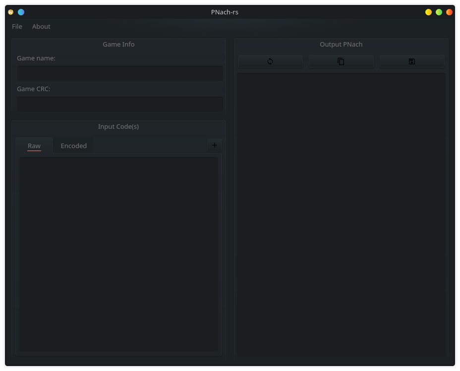
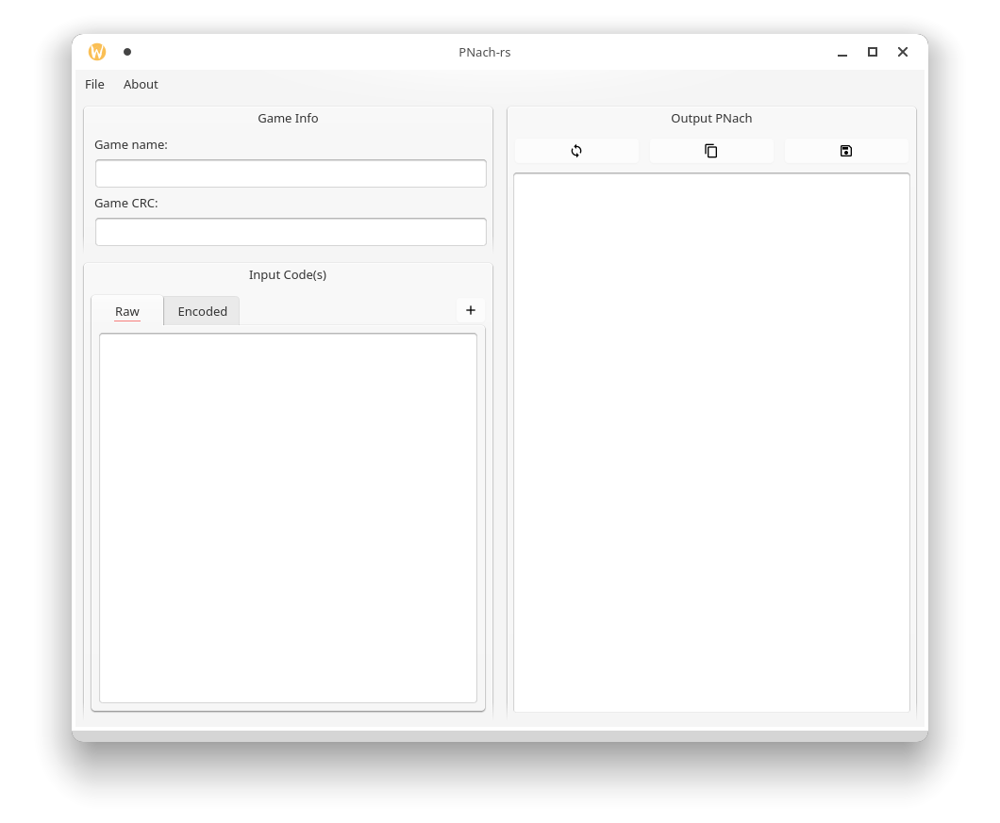

# PNach-rs
_Cross-platform PCSX2 cheat utility with Rust + Qt_

---

h2. Current status: 
- [x] Qt GUI
- [x] PNach creation
- [x] RAW code translation
- [ ] Code decryption/decoding

---

h3. Description
  
This project continues on the work done by [OmniConvert](https://github.com/pyriell/omniconvert) and, to some extent, [MultiConverter](https://forums.pcsx2.net/Thread-Multi-Converter-Cheats-decrypter-converter-editor-and-much-more).  
You can use it for taking random "cheat codes" you find on the internet and creating files compatible with the PCSX2 emulator.  
The software is cross-platform, built using Rust + Qt.
  
h3. Background

I had a PS2 growing up, and playing the games in an emulator still brings back nostalgia and fond memories.  
Recently, I turned to PCSX2 to help relive my childhood, only to find that the landscape of tools for working with GameShark/ActionReplay codes was pretty bleak. Lots of closed-source binaries posted and reposted to forums, lots of dead/broken links, etc. The current most popular option is MultiConverter which, after some reverse-engineering, turns out to be just an elaborate decade-old AutoHotKey script wrapping the functionality of OmniConvert.  
  
Having recently stumbled onto the lovely [Ritual](https://rust-qt.github.io/qt/) project for generating Qt 5.x Rust bindings, I was looking for a new GUI project to use as a testbed.
  
Out of this, pnach-rs was born!  
  
h3. Screenshots

Here's two screenshots for now, demoing the program in my two favorite KDE themes: [Sweet Mars](https://store.kde.org/p/1393507/) & [Orchis](https://store.kde.org/p/1458927/).  
Shoutout to eleverlara and vinceliuice for their beautiful themes!  
  

